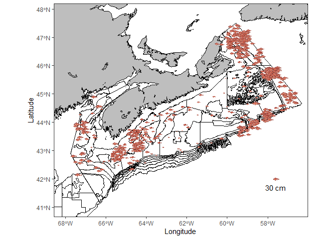

<!-- README.md is generated from README.Rmd. Please edit that file -->

# FishPlot

<!-- badges: start -->
<!-- badges: end -->

The goal of FishPlot is to plot the fish caught on the DFO Maritimes
Ecosystem Survey

fish to be plotted are sampled (with replacement) from the length data.
When nadj=1 the sample size is equal to

## Installation

You can install the development version of FishPlot from
[GitHub](https://github.com/) with:

``` r
# install.packages("pak")
pak::pak("BradHubley/FishPlot")

#or

devtools::install_github("BradHubley/FishPlot")
```

## Example

This is a basic example which shows you how to solve a common problem:

``` r
library(FishPlot)

## basic example code
 
RED_data.24<-subset(rv_data,YEAR==2024&SPEC==23 )
fishPlot(RED_data.24, SP=23,lab="Redfish2024",ladj=0.001,jadj=0.2,nadj=0.01,lscale=30 )
#> Linking to GEOS 3.13.0, GDAL 3.10.1, PROJ 9.5.1; sf_use_s2() is TRUE
#> 
#> Attaching package: 'dplyr'
#> The following objects are masked from 'package:stats':
#> 
#>     filter, lag
#> The following objects are masked from 'package:base':
#> 
#>     intersect, setdiff, setequal, union
#> Warning: Removed 5 rows containing missing values or values outside the scale range
#> (`geom_image()`).
#> Removed 5 rows containing missing values or values outside the scale range
#> (`geom_image()`).
```


